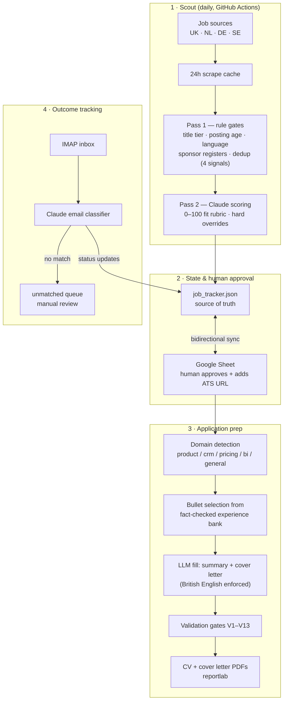

# Claude Workflow Automation — an agentic job-search pipeline

A production system that runs an international job search end-to-end: it scrapes postings across four markets daily, scores every role against my profile with a two-pass LLM architecture, generates a tailored CV and cover letter as polished PDFs for each approved role, reads my inbox to track application outcomes, and syncs everything to a Google Sheet that acts as the human approval layer.

Built and operated in production for my own search: **8,400+ roles evaluated, 140+ applications prepped and tracked**, at a marginal cost of roughly a tenth of a cent per scored job.

**Stack:** Claude Code · Anthropic API · MCP servers · Python · reportlab · Google Sheets API · IMAP · GitHub Actions

---

## Architecture

## What makes it trustworthy enough to run unattended

The interesting engineering here isn't the AI — it's the guardrails that let the AI run without supervision:

- **Two-pass scoring** — cheap deterministic gates (title tiers, posting age, language detection, visa sponsor registers) reject ~95% of scraped roles before any LLM call. Claude only scores survivors, keeping API cost near zero.
- **Four-signal deduplication** — job-ID + market match, URL match, fuzzy company+title match, and recruiter-slug matching that catches the same role re-posted by an agency under two different IDs.
- **Hard overrides on top of LLM scores** — a scored role can still be force-rejected or downgraded by rule (wrong role focus, SAP-primary tooling, consulting below threshold), so one generous LLM score can't leak a bad application through.
- **A fact-checked experience bank as the only content source** — the generator selects and rephrases real bullets; it cannot invent experience, metrics, or skills. Thirteen post-generation validation checks (V1–V13) verify structure, claims, spelling conventions, and domain-specific rules before any PDF is rendered.
- **Human approval gate** — nothing is ever submitted automatically. The Google Sheet is the control surface: a human reviews the shortlist, supplies the ATS URL, and flips the status that triggers prep.
- **Terminal-state protection** — rejected/withdrawn statuses can never be overwritten by automation; every status change appends to an audit history.
- **Self-checking workflow** — a `check_workflow.py` integrity suite (file presence, schema validation, sync consistency) runs via Claude Code hooks after any pipeline edit.

## Repo map

| Path | What it is |
|---|---|
| `scripts/` | The pipeline: scraping + cache, two-pass scoring, prep, PDF rendering, Sheets sync, email tracking, eval harness |
| `agents/` | Agent definitions: job scout, application prep, tracker |
| `skills/` | Reusable skills: score a JD, tailor a resume, draft a cover letter |
| `hooks/` | Event wiring: on-approval → prep, on-email → status update |
| `.claude/settings.json` | Claude Code hooks — post-edit integrity checks |
| `.github/workflows/` | Daily scheduled scout runs |
| `data/` | Private state layer — excluded here, see `data/README.md` |
| `workflow_reference.html` | Interactive walkthrough of the full 5-step workflow |

In production the pipeline is steered by a ~600-line `CLAUDE.md` — a declarative "constitution" of rules, scoring rubrics, and behavioural constraints that every agent session loads first. It contains personal search criteria, so it's excluded from this public copy.

## Notes

This repo is a portfolio snapshot, not a turnkey product: it needs API keys (`.env`), a Google service account, and personal content files to run. It's published to show the architecture — agent orchestration, LLM cost control, validation-gate design, and state management — rather than to be cloned and executed.

Built by **Vinay Patidar** — Lead Analytics professional (8+ years: ecommerce, marketplace, agri-tech) exploring what production-grade AI automation looks like when applied to a real, personal problem.

[LinkedIn](https://www.linkedin.com/in/vinaypatidar02) · vinay_patidar02@yahoo.com

## License

MIT — see [LICENSE](LICENSE).
